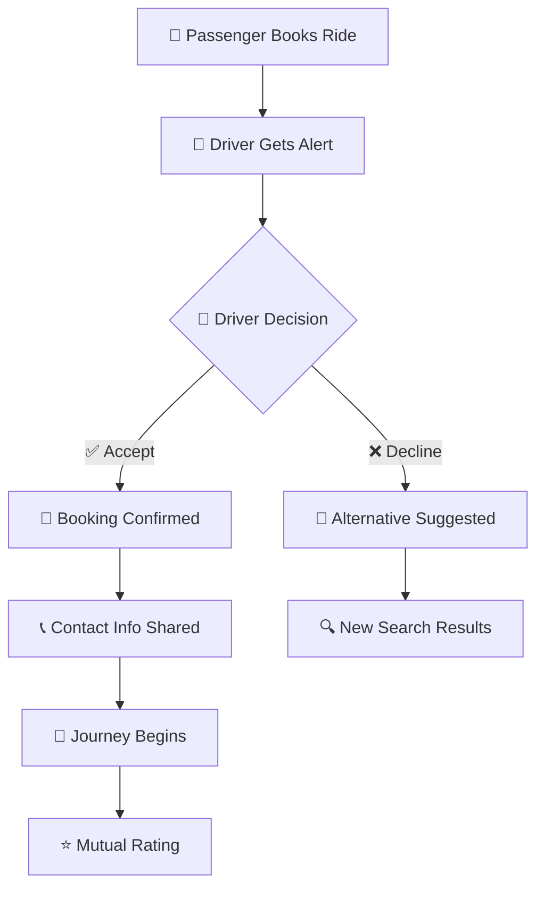

## 🌟 My DriveMate

<div align="center">

```
╔══════════════════════════════════════════════════════════════╗
║                                                              ║
║    ████████▄     ▄████████  ▄█   ▄█    █▄     ▄████████     ║
║    ███   ▀███   ███    ███ ███  ███    ███   ███    ███     ║
║    ███    ███   ███    ███ ███▌ ███    ███   ███    █▀      ║
║    ███    ███  ▄███▄▄▄▄██▀ ███▌ ███    ███  ▄███▄▄▄         ║
║    ███    ███ ▀▀███▀▀▀▀▀   ███▌ ███    ███ ▀▀███▀▀▀         ║
║    ███    ███ ▀███████████ ███  ███    ███   ███    █▄      ║
║    ███   ▄███   ███    ███ ███  ███    ███   ███    ███     ║
║    ████████▀    ███    ███ █▀    ▀██████▀    ██████████     ║
║                 ███    ███                                  ║
║                                                              ║
║                    🚀 THE FUTURE OF RIDE-SHARING 🚀          ║
║                                                              ║
╚══════════════════════════════════════════════════════════════╝
```

*Where every journey becomes an adventure*

[](https://reactjs.org/)
[](https://www.typescriptlang.org/)
[](https://supabase.com/)
[](https://tailwindcss.com/)
[](https://vitejs.dev/)

**✨ A revolutionary ride-sharing platform that connects souls through journeys ✨**

[🌐 Live Demo](https://your-demo-link.com) • [📖 Documentation](#-documentation) • [🐛 Report Bug](https://github.com/deepakjadon1902/MY_DriveMate/issues) • [💡 Request Feature](https://github.com/deepakjadon1902/MY_DriveMate/issues)

---

</div>

## 🎯 What Makes Drivemate Legendary?

<table>
<tr>
<td width="50%">

```
╔════════════════════╗
║   🚗 DRIVERS 🚗    ║
╠════════════════════╣
║ 💰 Monetize Routes ║
║ 📱 Live Alerts     ║
║ 🔧 Full Control    ║
║ 📊 Track Earnings  ║
║ 🌟 Build Ratings   ║
╚════════════════════╝
```

</td>
<td width="50%">

```
╔══════════════════════╗
║  🎒 PASSENGERS 🎒    ║
╠══════════════════════╣
║ 🔍 Smart Discovery  ║
║ ⚡ Instant Booking   ║
║ 💬 Direct Contact   ║
║ 🛡️ Secure Payments  ║
║ 📍 Live Tracking    ║
╚══════════════════════╝
```

</td>
</tr>
</table>

---


## 🛡️ **Tech Arsenal**

<div align="center">

### ⚡ **Frontend Powerhouse**

```
┌─────────────────────────────────────────────────────────────┐
│                     🎨 UI/UX STACK                         │
├─────────────────────────────────────────────────────────────┤
│ ⚛️  React 18        │ Core Framework    │ 🟢 Blazing Fast │
│ 📘 TypeScript       │ Type Safety       │ 🛡️ Bulletproof  │
│ ⚡ Vite             │ Build Tool        │ 🚀 Lightning    │
│ 🎨 Tailwind CSS     │ Styling Engine    │ ✨ Beautiful    │
│ 🎬 Framer Motion    │ Smooth Animations │ 🎭 Cinematic    │
│ 🧭 React Router     │ Navigation        │ 🌊 Seamless     │
│ 🎯 Lucide React     │ Icon Library      │ 💎 Crisp        │
│ 🍞 React Hot Toast  │ Notifications     │ 🔥 Instant      │
└─────────────────────────────────────────────────────────────┘
```

### 🔥 **Backend Infrastructure**

```
┌─────────────────────────────────────────────────────────────┐
│                   🏗️ SERVER ARCHITECTURE                   │
├─────────────────────────────────────────────────────────────┤
│ 🗄️  Supabase DB    │ PostgreSQL        │ 💪 Robust       │
│ 🔐 Auth System     │ Secure Login      │ 🛡️ Fort Knox    │
│ ⚡ Realtime        │ Live Updates      │ 📡 Instant      │
│ 🌐 Edge Functions  │ Serverless        │ ☁️  Limitless   │
│ 🔒 Row Level Sec   │ Data Protection   │ 🏰 Impenetrable │
└─────────────────────────────────────────────────────────────┘
```

</div>

---

## 🎮 **Feature Showcase**

### 🚘 **Driver Command Center**

```
╔═══════════════════════════════════════════════════════════════╗
║                      🎯 RIDE CREATION HUB                    ║
╠═══════════════════════════════════════════════════════════════╣
║  📍 Pickup & Drop Points     │  ⏰ Smart Scheduling          ║
║  🚗 Vehicle Registration     │  💸 Dynamic Pricing           ║
║  👥 Seat Management          │  📱 Push Notifications        ║
║  ✅ Request Approval         │  📞 Passenger Communication   ║
║  💰 Revenue Tracking         │  ⭐ Rating System             ║
╚═══════════════════════════════════════════════════════════════╝

    🔄 BOOKING LIFECYCLE
    ┌─────┐    ┌─────┐    ┌─────┐    ┌─────┐    ┌─────┐
    │ 📝  │ -> │ 📱  │ -> │ ✅  │ -> │ 🚗  │ -> │ ⭐  │
    │Post │    │Alert│    │Accept│   │Drive│    │Rate │
    └─────┘    └─────┘    └─────┘    └─────┘    └─────┘
```

### 🎒 **Passenger Discovery Engine**

```
╔═══════════════════════════════════════════════════════════════╗
║                    🔍 SMART RIDE FINDER                      ║
╠═══════════════════════════════════════════════════════════════╣
║  🗺️  Destination Search      │  📅 Date & Time Filters      ║
║  💰 Price Comparison         │  ⭐ Driver Ratings           ║
║  ⚡ One-Click Booking        │  📲 Real-time Status         ║
║  💬 In-App Messaging         │  📊 Journey Tracking         ║
║  🔔 Smart Notifications      │  📞 Direct Contact           ║
╚═══════════════════════════════════════════════════════════════╝

    🎯 BOOKING FLOW
    Search -> Filter -> Compare -> Book -> Connect -> Travel -> Rate
      🔍      🎛️       ⚖️        📝      🤝        🛣️       ⭐
```

---

## 🔔 **Intelligent Notification Ecosystem**

<div align="center">



*Smart notifications that keep everyone connected and informed*

</div>

---

## 👤 **Profile Paradise**

<div align="center">

### ✨ **Glassmorphism Experience**

```
    ╭─────────────────────────────────────────────────╮
    │                                                 │
    │    🌟 Welcome Back, Adventure Seeker! 🌟       │
    │                                                 │
    │    ┌─────────────────────────────────────────┐   │
    │    │  👤 Profile Info                       │   │
    │    │  ├── 📧 Email: user@example.com        │   │
    │    │  ├── 📱 Phone: +91-XXXXX-XXXXX         │   │
    │    │  └── 🎭 Role: Driver/Passenger         │   │
    │    └─────────────────────────────────────────┘   │
    │                                                 │
    │    ┌─────────────────────────────────────────┐   │
    │    │  📊 Journey Statistics                  │   │
    │    │  ├── 🚗 Rides Offered: 42              │   │
    │    │  ├── 🎒 Trips Taken: 28                │   │
    │    │  └── ⭐ Rating: 4.8/5.0                │   │
    │    └─────────────────────────────────────────┘   │
    │                                                 │
    ╰─────────────────────────────────────────────────╯
```

*Beautiful frosted glass effects with smooth animations*

</div>

---

## 🏗️ **Architecture & Fortress Security**

<div align="center">

### 🛡️ **Multi-Layer Defense System**

```
┌─────────────────────────────────────────────────────────────┐
│                    🏰 SECURITY FORTRESS                    │
├─────────────────────────────────────────────────────────────┤
│ Layer 1  │ 🔐 Row Level Security    │ 🛡️  Database Guard  │
│ Layer 2  │ 🚪 Protected Routes      │ 🔒 Navigation Lock  │
│ Layer 3  │ 🧹 Input Sanitization    │ ⚔️  XSS Shield     │
│ Layer 4  │ 🔑 JWT Authentication    │ 👑 Session Master  │
│ Layer 5  │ 🌐 HTTPS Encryption      │ 🔐 Data Vault      │
└─────────────────────────────────────────────────────────────┘
```

### 🏛️ **Clean Architecture Principles**

```
📦 MY DRIVEMATE
├── 🧩 components/
│   ├── 🎨 ui/          (Reusable UI elements)
│   ├── 🚗 driver/      (Driver-specific components)
│   └── 🎒 passenger/   (Passenger-specific components)
├── 🎣 hooks/
│   ├── 🔐 useAuth.ts   (Authentication logic)
│   ├── 🚗 useRides.ts  (Ride management)
│   └── 🔔 useNotifications.ts
├── 🌐 contexts/
│   ├── 👤 AuthContext.tsx
│   └── 🎨 ThemeContext.tsx
├── 📱 pages/
│   ├── 🏠 Home.tsx
│   ├── 🚗 DriverDashboard.tsx
│   └── 🎒 PassengerHub.tsx
└── 🛠️ utils/
    ├── 📊 supabase.ts
    └── 🔧 helpers.ts
```

</div>

---

## 🚀 **Lightning Quick Setup**

<div align="center">

### ⚡ **Get Started in Under 5 Minutes!**

</div>

```bash
# 🎯 Step 1: Clone the magic
git clone https://github.com/deepakjadon1902/My-DriveMate.git

# 🚀 Step 2: Enter the realm  
cd MY_DriveMate

# 📦 Step 3: Install superpowers
npm install

# ⚙️ Step 4: Configure environment
echo "VITE_SUPABASE_URL=your-supabase-url" > .env
echo "VITE_SUPABASE_ANON_KEY=your-anon-key" >> .env

# 🔥 Step 5: Launch into orbit!
npm run dev
```

### 🎛️ **Environment Configuration**

```env
# 🚀 Supabase Rocket Fuel
VITE_SUPABASE_URL=https://your-project.supabase.co
VITE_SUPABASE_ANON_KEY=your-super-secret-anon-key

# 📊 Analytics (Optional)
VITE_ANALYTICS_ID=your-analytics-tracking-id
VITE_SENTRY_DSN=your-error-tracking-dsn
```

---

## 📊 **Database Universe**

<div align="center">

```
╔══════════════════════════════════════════════════════════════╗
║                      🗄️ DATA GALAXY                         ║
╠══════════════════════════════════════════════════════════════╣
║                                                              ║
║  👤 PROFILES ←──────────┐                                    ║
║  ├── uuid: id          │                                    ║
║  ├── text: email       │                                    ║
║  ├── text: full_name   │         🚗 RIDES                   ║
║  ├── text: phone       │         ├── uuid: id               ║
║  └── text: role        │         ├── uuid: driver_id ──────┘ ║
║                        │         ├── text: pickup_location  ║
║  🎒 BOOKINGS           │         ├── text: destination       ║
║  ├── uuid: id          │         ├── timestamp: departure   ║
║  ├── uuid: passenger_id┴─────────├── text: car_model        ║
║  ├── uuid: ride_id ─────────────→├── text: car_plate        ║
║  ├── text: status               ├── decimal: price_per_seat ║
║  └── timestamp: created_at      └── int: available_seats   ║
║                                                              ║
║  🔔 NOTIFICATIONS                                            ║
║  ├── uuid: id                                               ║
║  ├── uuid: user_id ──────────────┐                          ║
║  ├── text: message               │                          ║
║  ├── text: type                  │                          ║
║  └── boolean: read               │                          ║
║                                  │                          ║
╚══════════════════════════════════════════════════════════════╝
```

</div>

---

## 🎨 **Visual Experience Gallery**

<div align="center">

### 📱 **Mobile-First Responsive Design**

```
┌─────────────────────────────────────────────────────────────┐
│                    📱 MOBILE VIEWS                         │
├─────────────────────────────────────────────────────────────┤
│                                                             │
│  🏠 HOME      🚗 DRIVER     🎒 PASSENGER    👤 PROFILE      │
│ ┌─────────┐  ┌─────────┐   ┌─────────┐    ┌─────────┐      │
│ │ Welcome │  │ Offer   │   │ Search  │    │ Stats   │      │
│ │ Login   │  │ Manage  │   │ Book    │    │ History │      │
│ │ Signup  │  │ Earn    │   │ Track   │    │ Settings│      │
│ └─────────┘  └─────────┘   └─────────┘    └─────────┘      │
│                                                             │
└─────────────────────────────────────────────────────────────┘
```

### 💻 **Desktop Powerhouse Interface**

```
┌─────────────────────────────────────────────────────────────┐
│ 🌟 DRIVEMATE                               🌙 🔔 👤        │
├─────────────────────────────────────────────────────────────┤
│                                                             │
│  📊 DASHBOARD           │  🗺️ MAP VIEW                     │
│  ┌─────────────────┐    │  ┌─────────────────────────────┐  │
│  │ • Active Rides  │    │  │     📍 Live Locations     │  │
│  │ • Bookings      │    │  │                             │  │
│  │ • Notifications │    │  │     🚗    📍    🎒        │  │
│  │ • Earnings      │    │  │                             │  │
│  └─────────────────┘    │  └─────────────────────────────┘  │
│                                                             │
└─────────────────────────────────────────────────────────────┘
```

</div>

---

## 🚀 **Cloud Deployment**

<div align="center">

### 🌐 **Global Infrastructure**

```
    ☁️ DEPLOYMENT PIPELINE
    
    GitHub Repo ──┐
                  │
                  ▼
    ┌─────────────────────┐
    │   🔄 Auto Deploy    │
    │   • Push to main    │ ──→ 🌍 Netlify CDN
    │   • Build & Test    │
    │   • Deploy Global   │
    └─────────────────────┘
                  │
                  ▼
    ┌─────────────────────┐
    │  🔒 SSL Certificate │
    │  🌍 Global CDN      │ ──→ ⚡ Lightning Fast
    │  📊 Analytics       │
    │  🔍 SEO Optimized   │
    └─────────────────────┘
```


</div>

---

## 🤝 **Join the Revolution**

<div align="center">

### 🌟 **Community Contributors Welcome!**

</div>

```bash
# 🍴 Fork the repository on GitHub
# 🌿 Create your feature branch
git checkout -b feature/GameChangingFeature

# ✨ Make your mark
git add .
git commit -m '✨ Add revolutionary GameChangingFeature'

# 🚀 Launch your contribution
git push origin feature/GameChangingFeature

# 📬 Create Pull Request and change the world!
```

### 🎯 **Ways to Make Impact**

<table>
<tr>
<td width="25%">

```
🐛 BUG HUNTERS
├── Find Issues
├── Report Bugs
├── Test Features
└── QA Testing
```

</td>
<td width="25%">

```
💡 VISIONARIES
├── Suggest Ideas
├── UX/UI Design
├── Feature Specs
└── Roadmap Input
```

</td>
<td width="25%">

```
📚 EDUCATORS
├── Documentation
├── Tutorials
├── Code Comments
└── Examples
```

</td>
<td width="25%">

```
⚡ CODE NINJAS
├── New Features
├── Performance
├── Refactoring
└── Architecture
```

</td>
</tr>
</table>

---

## 📈 **Project Metrics**

<div align="center">

```
┌─────────────────────────────────────────────────────────────┐
│                  🏆 ACHIEVEMENT UNLOCKED                   │
├─────────────────────────────────────────────────────────────┤
│                                                             │
│  ⭐ Stars Earned    │  🍴 Forks Created  │  🐛 Issues Solved │
│  ┌─────────────┐   │  ┌─────────────┐   │  ┌─────────────┐  │
│  │     🌟      │   │  │     🚀      │   │  │     ✅      │  │
│  │   Growing   │   │  │   Active    │   │  │   Resolved  │  │
│  └─────────────┘   │  └─────────────┘   │  └─────────────┘  │
│                                                             │
└─────────────────────────────────────────────────────────────┘
```


</div>

---

## 🌐 **Connect & Collaborate**

<div align="center">

### 💬 **Let's Build the Future Together!**

```
    🌟 SOCIAL CONSTELLATION 🌟
    
    LinkedIn ──┐    ┌── Twitter
               │    │
               ▼    ▼
    ┌─────────────────────┐
    │    🧑‍💻 DEEPAK        │
    │    Code Architect   │
    │    Dream Builder    │
    └─────────────────────┘
               ▲    ▲
               │    │
    GitHub ────┘    └── Portfolio
```

[](https://linkedin.com/in/deepakjadon)
[](https://github.com/deepakjadon1902)

### ☕ **Fuel the Innovation**

*Enjoyed the journey? Help keep the code flowing!*

[](https://buymeacoffee.com/deepakjadon)

</div>

---

## 📄 **License**

<div align="center">

```
╔══════════════════════════════════════════════════════════════╗
║                                                              ║
║                    📜 MIT LICENSE 📜                         ║
║                                                              ║
║   This project is open source and available under the       ║
║   MIT License. Feel free to use, modify, and distribute     ║
║   this code while keeping the original license intact.      ║
║                                                              ║
║   See LICENSE file for complete terms and conditions.       ║
║                                                              ║
╚══════════════════════════════════════════════════════════════╝
```

---

### 🌟 **Crafted with ❤️ by [Deepak Jadon](https://github.com/deepakjadon1902)**

```
    ╭─────────────────────────────────────────────╮
    │                                             │
    │   🚗 "Connecting people, one ride at a     │
    │      time - because every journey is       │
    │      better when shared." 🌟               │
    │                                             │
    │              - Deepak Jadon                 │
    │                                             │
    ╰─────────────────────────────────────────────╯
```

**⭐ If this project sparked your imagination, don't forget to star it! ⭐**

*Together, we're not just building an app - we're creating connections, fostering community, and making the world a little smaller, one shared ride at a time.* 🌍✨

</div>
